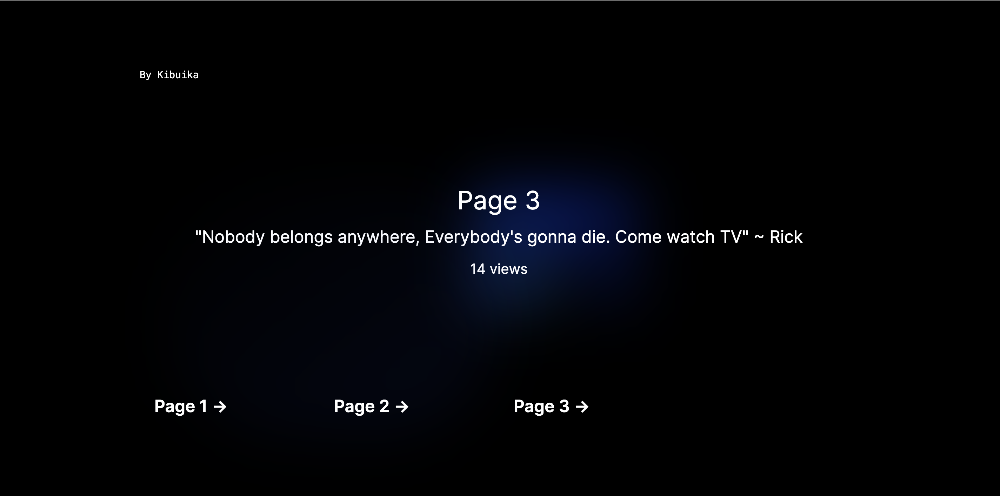

This is a Next.js project to test page views

There are 2 ways to approach this:

1. Just keep track of the views and increment by every view
2. Keep a record of views per date - this way, you can plot the data

This demo just demonstrates approach 1.

### Prerequisites

Create a Redis databse in [Upstash](https://upstash.com/)

Get the credentials and create an `env` file as `.env.example` shows.

## Get started

Install Dependencies

```bash
npm install
# or
yarn install
# or
pnpm install
```

then run

```bash
npm run dev
# or
yarn dev
# or
pnpm dev

```

Open [http://localhost:3000](http://localhost:3000) with your browser to see the result.
